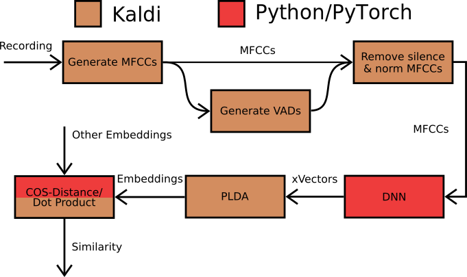

# PyTorch and Kaldi Speaker Identification and Diarization

A speaker identification and diarization solution based on PyTorch
and the VoxCeleb v2 example from Kaldi.

## What is this

This work is a speaker identification system based on the [Kaldi VoxCeleb v2 example](https://github.com/kaldi-asr/kaldi/tree/master/egs/voxceleb/v2). It enhances it by replacing the [nnet3](https://kaldi-asr.org/doc/dnn3.html#dnn3_intro) based neural network with one implemented using the [PyTorch](https://pytorch.org/) machine learning framework. This allows an easier and more dynamic change of the network architecture.

In addition to speaker identification with VoxCeleb this project also adds the ability to run diarization tasks. 

## Setup

Make sure the requirements listed in [What you need](#what_you_need) are given. The follow the steps described in [How to Install](#how_to_install).

### What you need

Before you can run this make sure you have the required tools available.
You need:
- An [Nvidia CUDA](https://developer.nvidia.com/cuda-zone) supporting graphic cart with more then 2 GB ram
- A current linux distribution on an x86 computer
- A fully operational installation of the [kaldi framework](https://kaldi-asr.org/)
- [PyTorch](https://pytorch.org/) with CUDA support
- A copy of the [VoxCeleb v1 and VoxCeleb v2](http://www.robots.ox.ac.uk/~vgg/data/voxceleb/) dataset
- A copy of the [MUSAN](https://www.openslr.org/17/) dataset

### How To Install

Follow these steps in order to be able to run this project. If something does not work or you don't understand something please open up an [issue](https://github.com/theScrabi/kaldi_voxceleb_pytorch/issues/new) and ask I'll be happy to help:

1. Make sure Kaldi and CUDA are installed and work correctly. 
2. Download this repo: `git clone https://github.com/theScrabi/kaldi_voxceleb_pytorch`
3. Enter the root directory of the project: `cd kaldi_voxceleb_pytorch`
4. Create a new Python virtual environment: `virtualenv venv`
5. Activate the virtual environment: `source venv/bin/activate`
6. Install the required Python packages: `pip install -r requirements.txt`
7. Edit the file `sid/path.sh` and set the `KALDI` variable to the path of your kaldi installation. (e.g.: `KALDI=/opt/kaldi`)
8. If you want to use diarization you need to edit `diarization/path.sh` and also set the `KALDI` variable there
9. Enter the diarization directory and run `./install.sh`. This will set the required symlinks.

### How To use

You can use the `run.sh` scripts in the `sid` folder for speaker identification or in the `diarization` folder for running training and testing.

For speaker identification please read the [README.md](sid/README.md) inside the `sid` folder. For diarization read the [README.mde](sid/README.me) in the `diarization` folder.

## Purpouse

The purpose of this work was to see if [Angular Softmax](https://arxiv.org/pdf/1806.03464.pdf) with Cosine distance comparison can enhance end to end speaker identification and diarization. The goal was to find out if  this could eventually outperform and replace the additional use of [PLDA](https://link.springer.com/content/pdf/10.1007%2F11744085_41.pdf). Additionally it was checked if the use of an [Attention Layer](http://www.danielpovey.com/files/2018_interspeech_xvector_attention.pdf) can also enhance speaker identification and diarization.

This was part of my Bachelor Thesis.

## Also Interesting

- [Sphereface](https://github.com/wy1iu/sphereface): The original implementation of the Angular margin based softmax implementation for face recognition.
- [Speech Brain](https://speechbrain.github.io/) An all in one PyTorch speech recognition framework.
- [pyannote.metric(https://pyannote.github.io/pyannote-metrics): A framework for diarization evaluation and error analysis.
- [kaldi with tensorflow dnn](https://github.com/hsn-zeinali/x-vector-kaldi-tf): A Tensorflow implementation of x-vector topology on top of kaldi.